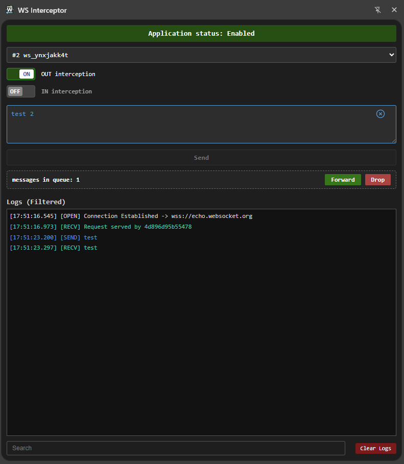

<p align="center">
  
</p>

# WS Interceptor

A lightweight, powerful Google Chrome Extension designed for real-time WebSocket traffic interception, inspection, and modification. It operates directly within the Chrome Side Panel, offering a clean developer-oriented interface to monitor and manipulate WebSocket frames on the fly.

One of the core strengths of this extension is its robust **multi-context architecture**, which allows it to intercept and control WebSocket connections established by the main page as well as those living inside nested `<iframe>` structures seamlessly.

## Key Features

- **Global Interception Toggle:** Quickly turn the extension state on or off. Automatically cleans up memory and restores standard WebSocket behaviors when disabled.
- **Bi-directional Interception (IN / OUT):** Choose to intercept outgoing traffic (Client ➔ Server) or incoming traffic (Server ➔ Client) independently per socket connection.
- **On-the-Fly Modification (Tampering):** Pause messages in an isolated queue, edit their payloads inside a textual editor, and then manually `Forward` the modified data or completely `Drop` the message before it reaches its destination.
- **Direct Emulation / Message Injection:** Send arbitrary standalone WebSocket messages directly through any selected open socket connection.
- **Smart Garbage Collection:** Utilizes a highly optimized `MutationObserver` combined with automated lifecycle tracking (`chrome.scripting` and `chrome.webNavigation`) to instantly remove dead sockets belonging to closed/destroyed iframes from the UI selector.

## Project Structure

```text
ws-inspector/
├── manifest.json         # Manifest V3 configuration mapping content & main-world scripts
├── background.js        # Service Worker running the state engine, queue tracker, & lifecycle janitor
├── content.js           # Isolated-world content script proxying data and tracking DOM mutations
├── ws-hook.js           # Main-world script monkey-patching native window.WebSocket constructor
├── index.html           # Side Panel markup declaration
├── css/
│   └── index.css        # Visual styles for the Side Panel layout
└── js/ (or root)
    └── app.js           # UI interaction, state rendering, and event handlers
```
## Architecture Flow

1. Injection: The extension injects ws-hook.js into the MAIN execution world of all pages and frames at document_start.
2. Hooking: ws-hook.js replaces the native window.WebSocket object, overriding the prototype send and event listener methods.
3. Communication Bridge: Intercepted events are funneled up through window messages (postMessage) to content.js (Isolated world), which proxies them directly into background.js.
4. State Management: background.js orchestrates whether messages should pass cleanly, stay paused in the modification queue, or trigger state updates inside the Side Panel UI (index.html).

## Installation
1. Clone or download this repository to your local machine (ensure the folder is named cleanly, e.g., ws-inspector).
2. Open your Google Chrome browser and navigate to chrome://extensions/.
3. Enable Developer mode via the toggle switch in the top-right corner.
4. Click on the Load unpacked button in the top-left corner.
5. Select the ws-inspector root directory containing the manifest.json file.

## How to Use
1. Click on the Extension icon in your toolbar to open the WebSocket Inspector Side Panel.
2. Click the global toggle button to switch the application status to App: Enabled.
3. Crucial: Refresh the webpage (or iframe container) you want to analyze. The extension hooks into WebSockets created after the tool is initialized.
4. Select the desired active socket instance from the dropdown selection list.
5. Check OUT interception or IN interception to begin pausing traffic for manual review and payload editing.
